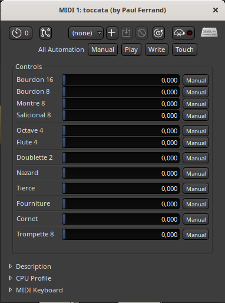

# toccata

`toccata.lv2` is a simple wavetable-based church organ as an LV2 plugin.
It uses the `sfizz` library to load an SFZ file containing the wavetables, and create LV2 parameters for the volume of each rank.
**Still very much a work in progress**.

.

To do:
- Add some simple reverb to sfizz and integrate a slider here so it sound better standalone
- Add a crescendo pedal
- Work on the wavetables: better management of attack, randomization, panning, etc...
